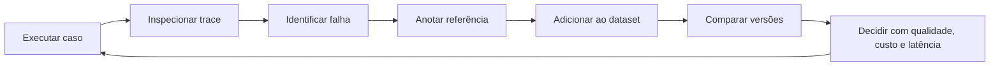

# LangSmith na prática — do trace à decisão de engenharia

Este é um curso de bancada em português, construído sobre o **Data Change Risk Analyst** e pensado para sua entrevista em até três dias. Você vai executar exemplos, encontrar evidências e ensaiar explicações. A meta é conseguir dizer **“eu medi, encontrei este problema e tomei esta decisão”**.

Comece pelo [roteiro de três dias](00-roteiro-3-dias.md). Se estiver diante do terminal agora, vá à [preparação](03-preparacao.md) e ao [primeiro trace](04-primeiro-trace.md).

O material tem três camadas:

- **Essencial:** a rota de três dias, cerca de 2–3 horas por dia, com pausas e prática oral.
- **Bancada completa:** todos os capítulos, mais de trinta atividades e dezessete scripts numerados.
- **Consulta:** [glossário](26-glossario.md), [fontes e validação](27-fontes-e-validacao.md) e [caderno de evidências](28-caderno-de-evidencias.md).

Os tempos são estimativas de estudo. Não incluem criar contas ou resolver acesso à rede. Se alguma conta travar, os exercícios locais permitem continuar.

## Como usar os laboratórios

Execute os comandos **na raiz do repositório**:

```bash
cd /home/doug/Projetos/ia/ws_datachange
.venv/bin/python ESTUDOS_LANGSMITH/labs/00_doctor.py
.venv/bin/python ESTUDOS_LANGSMITH/labs/01_trace_python.py
```

| Modo | O que acontece | Exemplos |
|---|---|---|
| Sem flags de envio/modelo | Cálculos, fixtures e grafo locais; nenhuma chamada de modelo | `01_trace_python.py`, `06_evaluate.py`, `16_consultar_runs.py` |
| `--send` | Envia dados sintéticos ao seu workspace; pode consumir a franquia/cobrança do LangSmith | `01_trace_python.py --send` |
| `--real` | Chama o provedor configurado no projeto, sujeito à cobrança dele | `07_real_model.py --real` |
| `--real --send` | Chama modelo e registra traces/experimentos | `07_real_model.py --real --send` |

`07_real_model.py` e `08_judge.py`, sem `--real`, mostram um ensaio sem chamar modelo. `15_langfuse.py` tem ambiente separado, explicado no capítulo 21. `12_regression_gate.py` só lê resultados locais. `00_doctor.py` só inspeciona a configuração local. `16_consultar_runs.py` agrega uma árvore sintética sem flags e, com `--send`, **lê** os runs que você já criou em vez de escrever novos.

“Sem modelo” não significa que o serviço de observabilidade seja ilimitado ou gratuito. Os preços **numéricos** do laboratório de custos são explicitamente fictícios. Consulte sua conta antes de ampliar experimentos.

Os scripts usam um projeto de tracing próprio, `dcra-estudos`; o laboratório de custos sintéticos usa outro nome para você reconhecer os números inventados. Dados criados no SaaS permanecem na sua conta. Arquivos gerados ficam em `ESTUDOS_LANGSMITH/artefatos/`, ignorados pelo Git.

## Índice por pergunta

| Bloco | Pergunta que você aprenderá a responder |
|---|---|
| [00 · Roteiro](00-roteiro-3-dias.md) | O que priorizar nestes três dias? |
| [01 · Projeto real](01-mapa-do-projeto.md) | O que este projeto usa, e o que ainda não usa? |
| [02 · Fundamentos](02-fundamentos-observabilidade.md) | Por que logs, métricas, traces e evals se complementam? |
| [03 · Preparação](03-preparacao.md) | Como configurar conta, projeto, chaves e ambiente? |
| [04 · Primeiro trace](04-primeiro-trace.md) | Como criar e ler um trace sem gastar com modelo? |
| [05 · Dissecar o DCRA](05-dissecar-dcra.md) | Como navegar do resultado ao nó e ao código responsável? |
| [06 · Threads e checkpoints](06-threads-checkpoints-revisao.md) | Como ligar execução, pausa, retomada e decisão humana? |
| [07 · Falhas e retries](07-falhas-latencia-retries.md) | Como um trace verde pode conter falhas e degradação? |
| [08 · Instrumentação e contexto](08-instrumentacao-contexto.md) | Como instrumentar Python, threads e serviços? |
| [09 · Custos](09-tokens-custos-orcamentos.md) | Como medir e limitar custo sem contar tokens duas vezes? |
| [10 · Feedback humano](10-feedback-anotacao.md) | Como transformar opinião em dado utilizável? |
| [11 · Datasets](11-datasets-contratos.md) | Como construir uma prova justa e versionada? |
| [12 · Avaliadores de código](12-evals-deterministicos.md) | Como medir contratos e detectar uma regressão crítica? |
| [13 · Experimentos](13-experimentos-comparacao.md) | Como comparar versões sem se enganar com médias? |
| [14 · Modelo real](14-modelo-real-saida-estruturada.md) | Como avaliar interpretação e structured output? |
| [15 · Juiz LLM](15-juiz-llm-calibracao.md) | Como verificar se quem dá a nota sabe corrigir a prova? |
| [16 · Workflow e agentes](16-avaliar-workflow-agentes.md) | Como avaliar caminhos, ferramentas e revisão humana? |
| [17 · Reprodutibilidade](17-reprodutibilidade-prompts.md) | O que registrar para comparar e reconstruir resultados? |
| [18 · Avaliação online](18-evals-online-producao.md) | Como fechar o ciclo entre tráfego, falha e regressão? |
| [19 · Privacidade e amostragem](19-privacidade-amostragem.md) | Como observar sem exportar tudo nem distorcer métricas? |
| [20 · RAG fora do projeto](20-rag-fora-do-projeto.md) | O problema foi buscar a evidência ou usá-la? |
| [21 · Langfuse e OpenTelemetry](21-langfuse-otel.md) | Quais conceitos continuam valendo ao trocar de ferramenta? |
| [22 · Operação e incidentes](22-operacao-slos-incidentes.md) | Como agregar traces em métricas e investigar sob pressão? |
| [23 · Gate em CI](23-ci-gates.md) | Como uma métrica vira critério de aprovação de mudança? |
| [24 · Entrevista simulada](24-entrevista-simulada.md) | Como explicar tudo sem exagerar o que foi implementado? |
| [25 · Desafios e gabaritos](25-desafios-gabarito.md) | Consigo resolver sem consultar a resposta? |
| [26 · Glossário](26-glossario.md) | Quais termos preciso reconhecer e usar corretamente? |
| [27 · Fontes e validação](27-fontes-e-validacao.md) | Quais APIs foram conferidas e o que foi realmente executado? |
| [28 · Caderno](28-caderno-de-evidencias.md) | Onde registro meus traces, conclusões e respostas? |

## O ciclo que conecta os blocos



Este curso acrescenta **material de estudo e adaptadores de laboratório**. O código do produto continua congelado. Quando usamos o grafo real com dependências falsas, isso aparece como `fixture`. Quando uma prática ainda não existe na aplicação publicada, o capítulo a identifica como extensão de estudo.

Não precisa decorar a posição de cada botão. Precisa saber qual pergunta fazer, qual evidência procurar e qual conclusão essa evidência permite. A interface é o microscópio; a engenharia é o raciocínio de quem olha pela lente.
