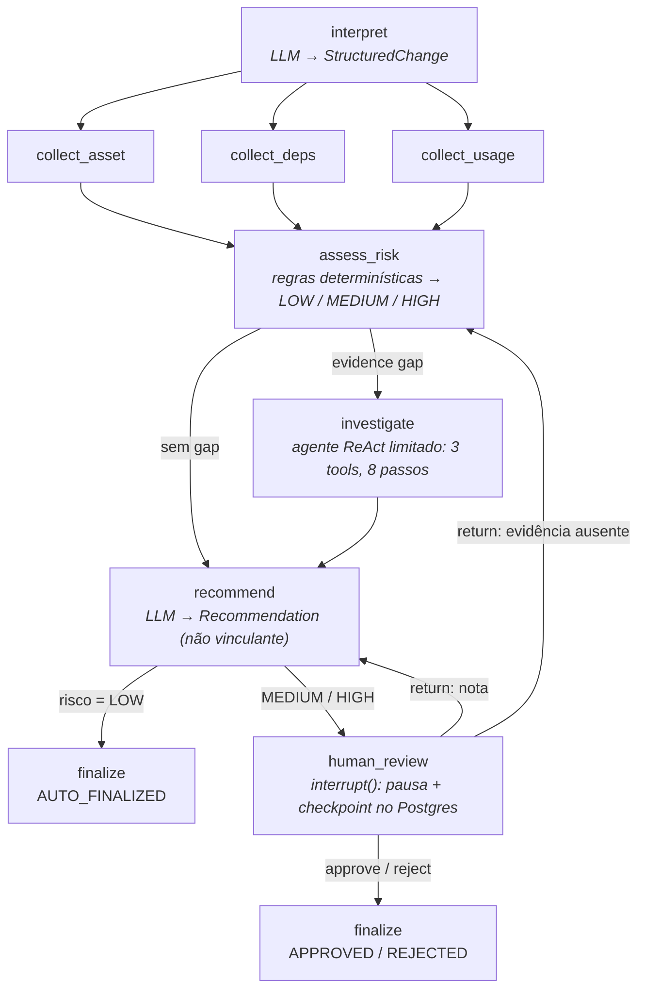
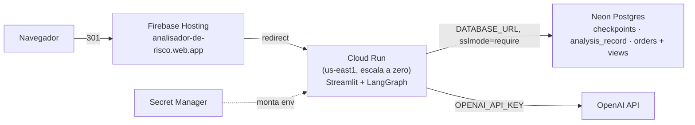
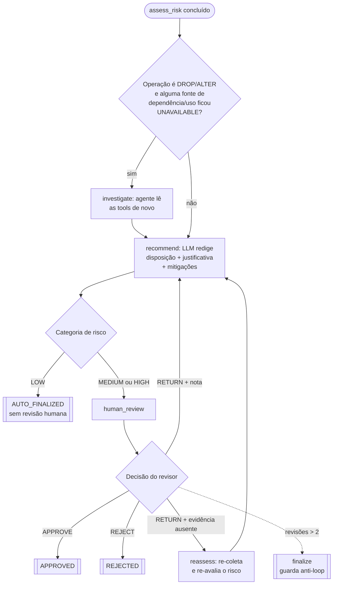
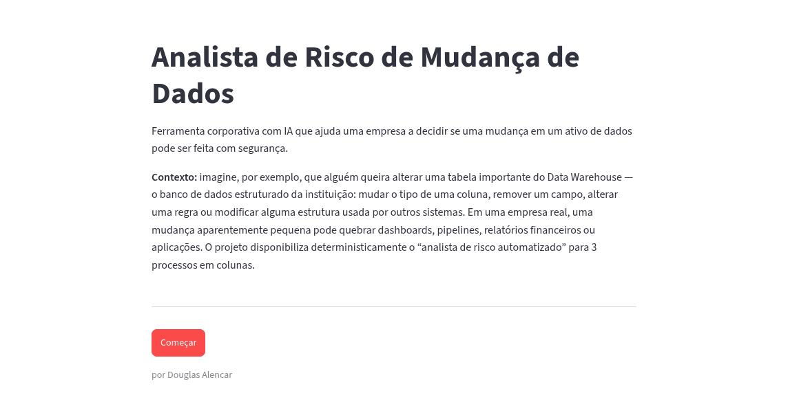
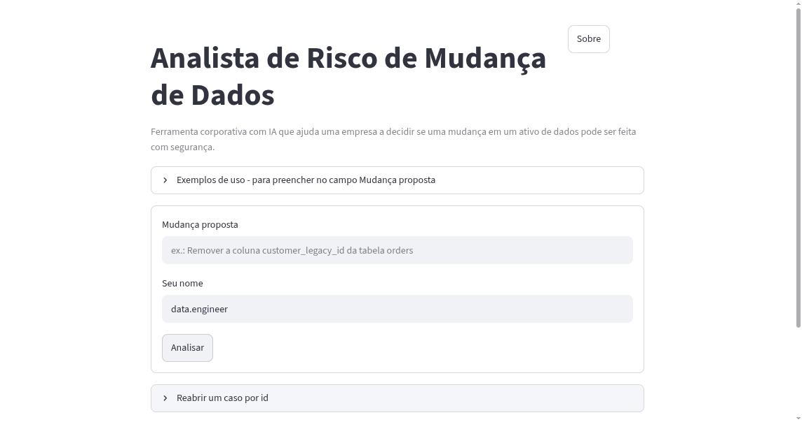
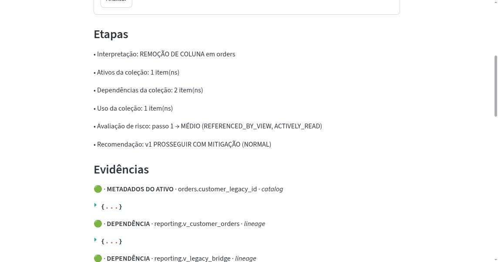
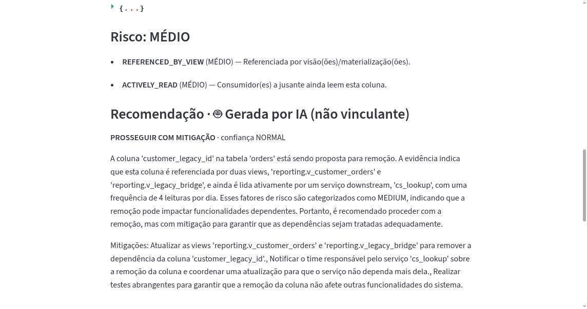
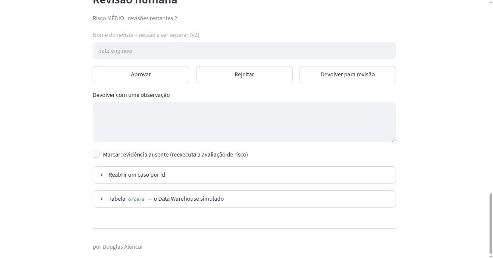
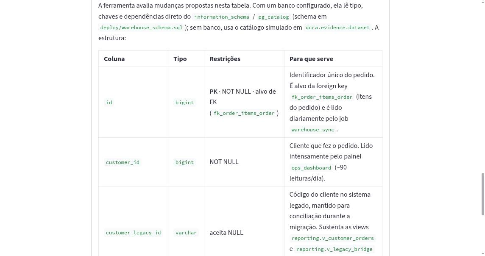
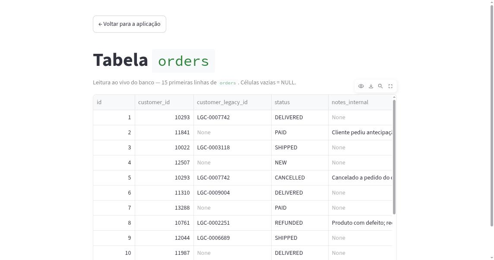

# Data Change Risk Analyst

**Status: Concluído (em produção)** · Portfólio · Engenharia assistida por IA

Ferramenta corporativa com IA que ajuda a decidir se uma mudança em um ativo
de dados (dropar uma coluna, alterar um tipo, criar um índice) pode ser feita
com segurança. Ela interpreta o pedido, coleta evidências do banco, aplica uma
política de risco **determinística**, redige uma recomendação **não vinculante**
com um LLM e **pausa para revisão humana** antes de registrar qualquer decisão.

- **No ar:** https://analisador-de-risco.web.app
- **Repositório:** https://github.com/alencardoug/data-change-risk-analyst
- **Publicação:** 2026-08-31
- **Dados:** sintéticos/demo — sistema fictício para demonstração técnica.

---

## Natureza do projeto

Projeto de portfólio de **AI Engineering**, desenvolvido com engenharia assistida
por IA sob **Spec-Driven Development (SDD)**: constituição → especificação →
clarificação → plano → tarefas → implementação, com os artefatos versionados no
repositório (`specs/`, `*_SEED.md`, `DECISIONS.md`). O objetivo declarado era
mostrar usos **reais e defensáveis** de LangGraph e LangChain — orquestração de
workflow, roteamento determinístico, fan-out paralelo com reducer,
`interrupt`/`resume` com checkpointing e um agente ReAct limitado — sem virar
uma plataforma de gestão de mudanças de produção.

---

## Evidências

| Métrica | Valor |
|---|---:|
| Janela de desenvolvimento | 27–31 ago 2026 (5 dias, da discovery ao deploy) |
| Commits | 31 |
| Pull requests mergeados | 10 |
| ADRs (decisões de arquitetura registradas) | 21 |
| Requisitos funcionais rastreados (`FR-###`) | 25 |
| Código-fonte | ~2.400 linhas · 30 arquivos `.py` |
| Testes (casos coletados) | 76 · em 26 arquivos (unit, e2e, MCP, integração-LLM) |
| Dependências de runtime · pacotes resolvidos | 13 · 97 |

> As contagens são do próprio repositório na data de publicação; parte dos
> testes e2e é *DB-gated* (pula sem um Postgres acessível), e os de integração
> com LLM real são *opt-in*.

---

## Decisão arquitetural

**Grafo de estado (LangGraph) com fronteira rígida entre o que é determinístico
e o que é probabilístico.** O LLM nunca decide a categoria de risco nem o
roteamento — ele só produz *saída estruturada* em dois pontos: interpretar o
pedido (`StructuredChange`) e redigir a recomendação (`Recommendation`,
explicitamente não vinculante). Tudo que decide o caminho do caso — coletar
evidência, classificar risco, mandar para revisão, finalizar — é Python puro e
reprodutível.

**Human-in-the-loop obrigatório para MEDIUM/HIGH.** O grafo chama `interrupt()`,
o estado é gravado no Postgres, e o processo espera. Um `Command(resume=...)`
retoma exatamente de onde parou — sobrevive a restart do app ou do banco. A
recomendação da IA e a decisão humana ficam gravadas como **campos separados**.

**O que foi deliberadamente NÃO construído:** autenticação/multiusuário,
aplicação real do DDL, catálogo de dados próprio, fila assíncrona, camada de
autorização, HA/autoscaling. O "uso a jusante" por coluna (quantas leituras/dia
cada consumidor faz) permanece sintético — num cenário real viria de um data
catalog, `pg_stat_statements` ou APIs de BI.

---

## Arquitetura

### Fluxo do caso (LangGraph)

- **Fan-out / fan-in:** os três coletores rodam em paralelo; um *reducer* mescla
  as escritas concorrentes no campo `evidence` do estado.
- **Coleta de evidência = introspecção real de Postgres.** Com um banco
  configurado, `collect_asset` / `collect_deps` leem tipo, `NOT NULL`, PK,
  UNIQUE de `information_schema.columns` + `table_constraints`; dependências de
  `information_schema.view_column_usage` (views) e `pg_constraint` (foreign keys
  de entrada). Sem banco, cai num catálogo simulado equivalente.
- **Loop limitado:** `RETURN` do revisor re-recomenda (ou re-coleta + re-avalia,
  se marcado "evidência ausente"); um guarda em `revision_limit = 2` impede loop
  infinito.
- **Persistência:** `analysis_record` (uma linha por caso; risco, recomendações
  e decisões são *arrays JSON append-only* — o "atual" é sempre `arr[-1]`) +
  as 4 tabelas de checkpoint do LangGraph. A chave `thread_id` liga as duas.
- **Observabilidade:** tracing opcional via LangSmith (mesmo `thread_id`).

### Topologia de deploy

- **Firebase Hosting só como redirect 301:** o Hosting não faz proxy do
  WebSocket do Streamlit, então serve apenas de porta de entrada memorável para
  a URL do Cloud Run.
- **Cloud Run:** imagem `python:3.13-slim` + `uv`, `--min-instances=0`
  (sem custo ocioso), `--max-instances=1` (sessão do Streamlit coerente sem
  session affinity), `--timeout=3600` (WebSocket de longa duração).
- **Neon:** plano gratuito; o checkpointer usa um `ConnectionPool` com pre-ping,
  então o autosuspend do Neon é transparente.
- **Custo esperado:** dentro do free tier de Cloud Run / Neon / Firebase; só a
  OpenAI é cobrada por uso (independe da infra).

---

## Stack

| Camada | Tecnologias |
|---|---|
| Orquestração | **LangGraph** (grafo de estado, checkpointing, `interrupt`/`resume`), `langgraph-checkpoint-postgres` |
| LLM | **LangChain** (saída estruturada, tools `@tool`, agente ReAct), `langchain-openai` (padrão `gpt-4o`) |
| Ferramentas remotas | **MCP** (`mcp`, `langchain-mcp-adapters`) — leitor de uso a jusante opcional |
| Domínio | **Pydantic v2** (contratos), regras de risco em Python puro |
| Banco | **PostgreSQL** via **psycopg 3** + `psycopg_pool`; introspecção por `information_schema` / `pg_catalog` |
| UI | **Streamlit** (form, resultado passo a passo, portão de revisão, visão da tabela) |
| Observabilidade | **LangSmith** (tracing opcional) |
| Runtime | **Docker** (`python:3.13-slim` + `uv`) |
| Produção | **Google Cloud Run**, **Neon**, **Firebase Hosting**, **Secret Manager**, **Cloud Build** |
| Dev | `uv`, `ruff`, `pytest` |

---

## Estado atual e próximos passos

**Estável e publicado.** O produto está completo e **congelado** — não há
próximos passos previstos por ora.

Possíveis evoluções, se um dia forem retomadas:

- **Uso a jusante real** por coluna (data catalog / `pg_stat_statements` / APIs
  de BI), substituindo o sinal sintético — hoje a única parte não real do fluxo.
- Aplicação assistida do DDL (gerar o `ALTER`/`DROP` + plano de rollback).
- Autenticação e multiusuário (o campo "revisor" já antecipa essa separação).

Defeito conhecido e **não** corrigido: o dropdown de "casos em aberto" em
*Reabrir um caso* não popula no ambiente publicado (reabrir por `thread_id`
funciona) — ver `KNOWN_ISSUES.md`.

---

## Geração da recomendação — árvore de decisão

A recomendação e o desfecho de um caso seguem uma árvore **fixa em código**; o
LLM entra apenas nas folhas de texto (`recommend`), nunca nas ramificações.

**Ordem de execução e autonomia:**

1. **Interpretação** (`interpret`) — o LLM converte o texto livre em
   `StructuredChange` (`operation`, `target_table`, `target_column`, …), validado
   contra um schema Pydantic. Falha de interpretação → nenhum registro é criado.
2. **Coleta** (paralela) — funções de leitura contra o Postgres; nunca escrevem,
   nunca rodam DDL, nunca fabricam um fato para uma evidência indisponível.
3. **Classificação de risco** (`assess_risk`) — regras Python puras. Cada
   predicado nomeado que dispara é um `RiskFactor` com severidade própria; a
   **categoria final é a severidade máxima** entre os fatores:

   | Fator | Severidade |
   |---|---|
   | `ASSET_NOT_FOUND`, `IN_PRIMARY_KEY`, `IN_UNIQUE_CONSTRAINT`, `INBOUND_FOREIGN_KEY` | HIGH |
   | `REFERENCED_BY_VIEW`, `ACTIVELY_READ`, `EVIDENCE_UNAVAILABLE`, `INDEX_BUILD_CONTENTION` | MEDIUM |
   | `ADD_INDEX_LOW_RISK`, `NO_DEPENDENTS_OR_USAGE` | LOW |

4. **Recomendação** (`recommend`) — o LLM recebe a mudança, a evidência, a
   categoria e os fatores, e devolve `PROCEED` · `PROCEED_WITH_MITIGATION`
   (com lista de mitigações) · `DO_NOT_PROCEED`, com justificativa em português.
   É rotulada "🤖 Gerada por IA (não vinculante)" na interface.
5. **Roteamento** — `LOW` finaliza sozinho (`AUTO_FINALIZED`); `MEDIUM`/`HIGH`
   vão ao portão humano. Nada disso é decidido pelo LLM.

---

## Evidências visuais

| | |
|---|---|
| **Apresentação** — contexto do problema antes da ferramenta |  |
| **Formulário** — o pedido em linguagem natural + exemplos |  |
| **Etapas + Evidências** — o grafo avançando e a evidência lida do `information_schema` real (views de `reporting`, FKs) |  |
| **Risco + Recomendação** — `MÉDIO` com fatores nomeados e a recomendação da IA (não vinculante), em português |  |
| **Revisão humana** — o portão: aprovar / rejeitar / devolver, com o motivo do risco |  |
| **Estrutura da tabela `orders`** — coluna, tipo, restrições (PK/FK/constraint) e para que serve |  |
| **Tabela `orders`** — leitura ao vivo do banco: cabeçalho + 15 linhas |  |
